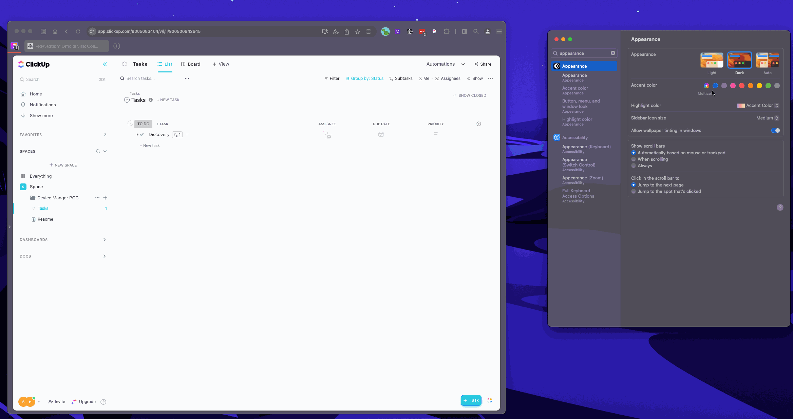

## Overview

ClickUp has a setting to enable/disable dark mode, but it must be toggled manually. This extension changes it automatically based on the user's OS theme (dark mode / light mode).

## Limitations
- Not yet tested with ClickUp 3.0

### Loading the extension
To load this extension in your browser, follow the [Chrome dev instructions](https://developer.chrome.com/docs/extensions/mv3/getstarted/development-basics/#load-unpacked).

### Extension in action

